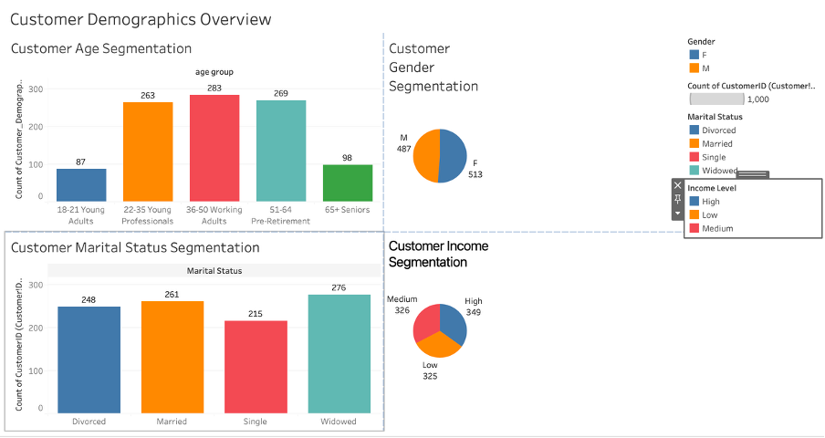
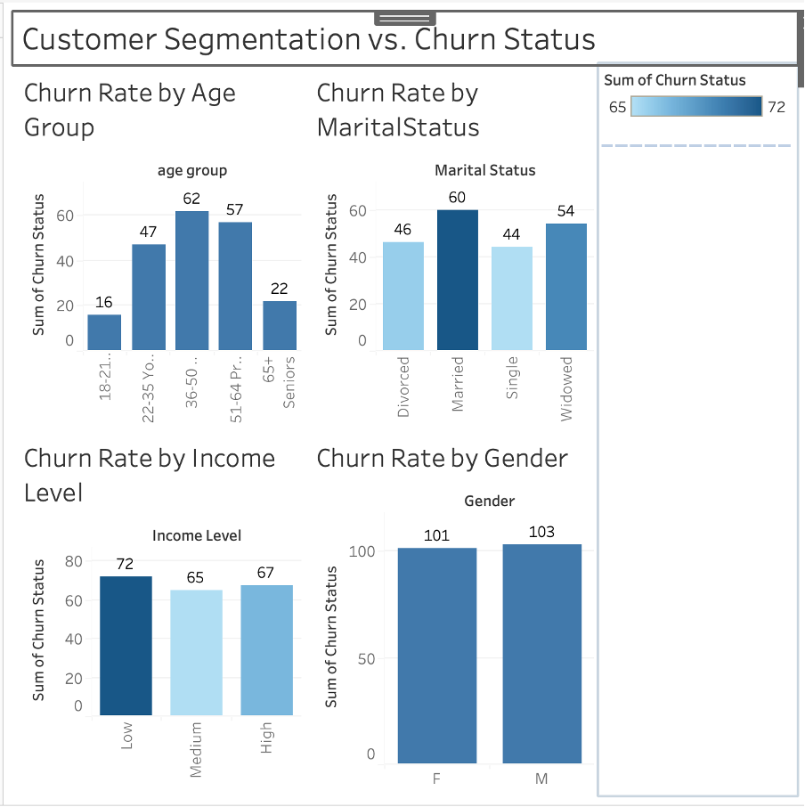
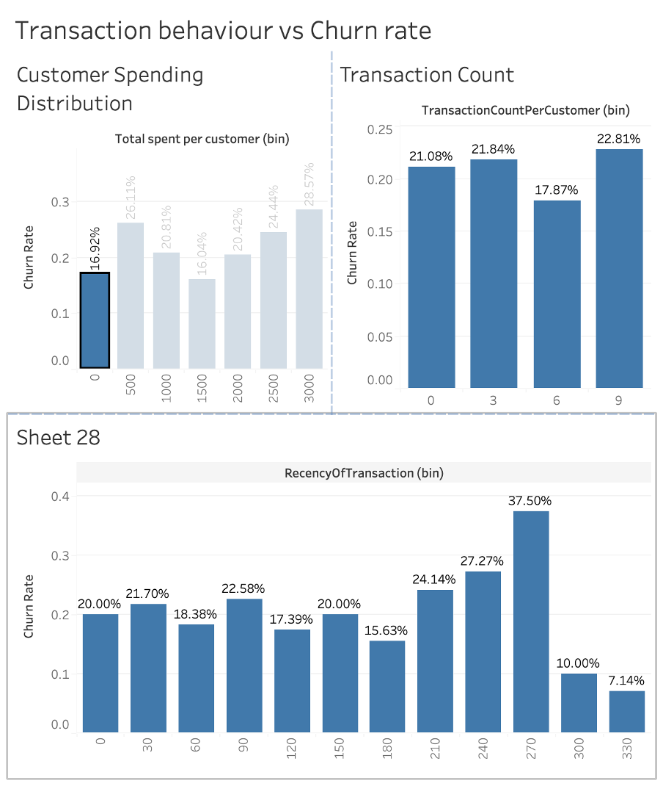
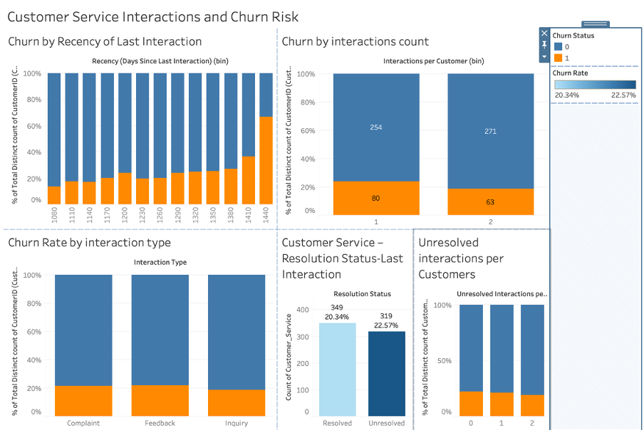
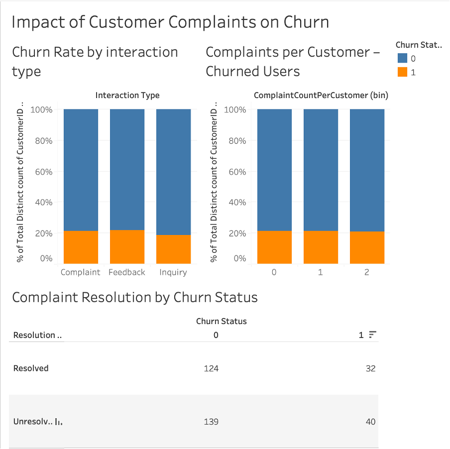
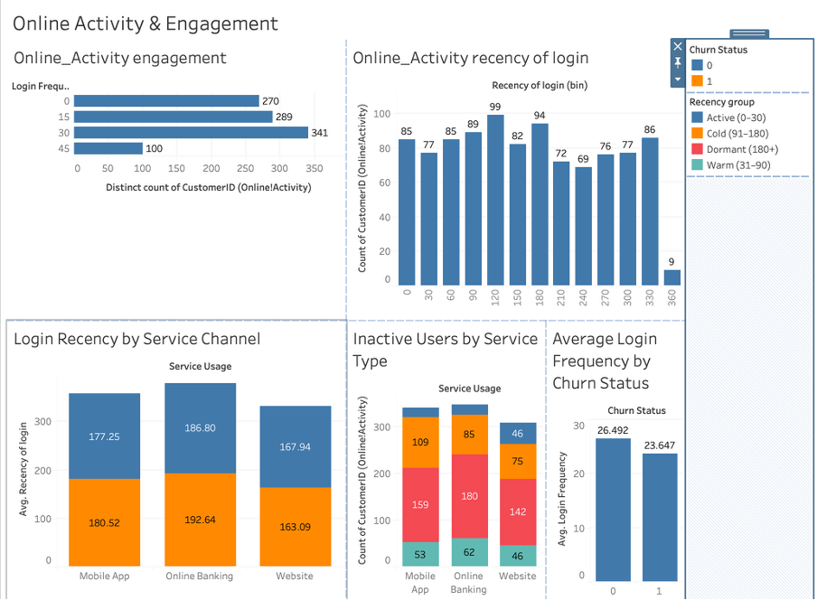

# Customer-churn-data-analysis  
This Tableau project explores customer churn behaviour for exploratory data analysis (EDA)using customer geograph and service interaction data. It focuses on identifying early churn indicators through analysis of interaction frequency, interaction type, resolution status, and recency of the final customer interaction.

## Interactive Dashboard
[View Interactive Tableau Dashboard:](https://public.tableau.com/views/Bankcustomerchurndataanalysis/CustomerServiceResolution?:language=en-GB&:sid=&:redirect=auth&:display_count=n&:origin=viz_share_link)

## Tools and Technologies
Tableau Desktop Public Edition version 2025.2.4
Microsoft Excel

## Dataset Description
The dataset is sourced from the Lloyds Banking Group Virtual Experience programme on Forage and is organised across multiple tables, including Customer_Demographics, Transaction_History, Customer_Service, Online_Activity, and Churn_Status. Together, these tables contain anonymised customer segmentation, customer service interaction, and behavioural data, including catogories like interaction type, resolution status, and interaction dates.

## Data Preparation
Data cleaning and preparation were carried out using Excel and Python (Google Colab). This process included validation of categorical fields, detection of outliers in numerical variables such as age and transaction amounts, handling missing values, removal of duplicate records, and correction of data types. The detailed data cleaning workflow and code are documented in a separate repository, available here: 🧹 [Data Cleaning Repository](https://github.com/Alaina-dev/Data-cleaning-Customer-churn-data-analysis). 

Additional features were created during the analysis phase in Tableau to support analysis, including derived metrics such as interaction frequency per customer and recency of the last interaction..
### Calculated Fields Summary
Customer-level metrics were created using Tableau LOD calculations to ensure accurate aggregation.
- Age group
	Churn Rate
	ComplaintCountPerCustomer
	Interactions per Customer
	Is Last Interaction?
	Last Interaction Date
	LastPurchaseDate Per Customer
	Recency (Days Since Last Interaction)
	Recency of login
	Rencency group
	RecencyDays
	RecencyOfTransaction
	Service Frequency
	Total spent per customer
	TotalSpentPerCustomer
	Transaction group
	TransactionCountPerCustomer
	Unresolved Interactions per Customer

## Analysis Overview
The analysis examines the relationship between customer churn and multiple behavioural and demographic factors, including demographic categories, complaint activity, resolution status of the final interaction, and RFM metrics (transaction recency, frequency, and monetary value). It also explores customer service interaction patterns such as interaction timing, frequency, and type, as well as digital engagement indicators including login frequency, recency, and service channel usage.

 ### Dashboards

 ### Key Insights
Customer churn is driven primarily by behavioural disengagement rather than static demographics alone. While churn varies across demographic groups, it is most pronounced among customers aged 36–64, with minimal differences observed by gender and relatively balanced churn across income levels. This suggests demographics provide context but are not the strongest predictors of churn.
Transaction behaviour analysis shows that transaction recency is the most influential predictor of churn. Customers who have not transacted recently are significantly more likely to churn, while total spend and transaction frequency demonstrate weaker and more non-linear relationships.
Customer service experience plays a critical role in churn outcomes. Churn risk is strongly associated with unresolved final interactions, particularly when followed by prolonged inactivity. Complaints themselves do not directly cause churn; instead, churn increases when complaints are repeated, unresolved, or poorly followed up, indicating failures in service recovery.
Digital engagement is a strong early warning indicator. Customers with lower login frequency and longer periods since their last login show significantly higher churn risk, highlighting declining digital activity as a key signal of disengagement.
Overall, early churn signals are best identified through recency, unresolved service issues, and declining engagement, rather than customer volume or value alone.

## Full Report
For a detailed methodology, analysis, and interpretation of results, see the full report here:  
📄 [Download the full analysis report (PDF)](reports/Customer_churn_data_analysis_report.pdf)

## Future Work
This dataset could be extended into predictive modelling by encoding categorical variables and scaling numerical features for machine-learning algorithms.
